# 🌍 Za obzorem · Beyond the Horizon

**Školní simulace toho, jak zakřivení Země schovává vzdálené věci.**
Pro žáky základních škol. Česky i anglicky. Bez knihoven, bez sestavování — stačí otevřít `index.html`.

[](https://github.com/richardLipka/beyond-the-horizon/actions/workflows/ci.yml)
[](LICENSE)
[](package.json)

🇬🇧 **[English version of this file →](README.md)**
▶️ **[Živá ukázka](https://richardlipka.github.io/beyond-the-horizon/)**


---

## Co to umí

Nastavíš, jak vysoko máš oči, vybereš, na co se díváš, a posuvníkem to odsuneš
do dálky. Aplikace odpověď nakreslí rovnou třikrát — jako okótovaný boční pohled
na zakřivenou Zemi, jako pohled dalekohledem a jako čísla.

### 👁️ Co uvidím?

Boční pohled má **všechny míry přímo v obrázku**: vzdálenost k obzoru, o kolik je
objekt dál, kolik z něj je schováno, kolik zbývá vidět, vyboulení vody uprostřed
cesty, měřítko vzdálenosti s ryskami i měřítkovou úsečku. Vedle toho kulaté
okénko ukazuje, co bys viděl na vlastní oči — schovaná část je čárkovaný duch
pod hladinou.


Pod dalekohledem je kruhové schéma tělesa, jak by vypadalo z vesmíru přímo nad
tebou, a leží na něm **tři kružnice ve skutečném poměru**: tvůj obzor,
vzdálenost, ve které vybraný objekt zmizí, a čárkovaně nastavená vzdálenost.
První dvě nejsou z lidské výšky na kouli prakticky vidět – a přesně o to jde –
takže vedle je rovnoměrně zvětšený výřez s vypsaným zvětšením. Ke každé
kružnici se počítá plocha vrchlíku a její podíl na celém povrchu: ze 170 cm na
Zemi je vidět 68 km², tedy 1 : 7 495 306.

Boční pohled má vždycky v záběru oba aktéry: místo pro ikonu objektu
i postavičku se rezervuje **v pixelech**, protože jejich šířky ze světových
souřadnic neplynou, a povrch se kreslí širší než rámeček, aby pod rezervovanými
okraji nezůstal prázdný klín.

#### Až na oběžnou dráhu

Kromě sedmi pozemských stanovišť — leh na pláži, dítě, dospělý, balkon,
rozhledna, útes, letadlo — jsou k dispozici **čtyři oběžné dráhy**, a nejsou
zadané ručně. Nízká leží šestnáctinu poloměru nad povrchem, protože zdola ji
omezuje atmosféra, ne oběžná doba; zbylé tři jsou dané tím, jak dlouho trvá
jeden oblet, takže vycházejí z hmotnosti a rychlosti otáčení tělesa:

| Ze Země | Výška | Jeden oblet | Vidíš |
| --- | --- | --- | --- |
| Nízká dráha | 398 km | 92 minut | 2,9 % povrchu |
| Střední dráha | 20 191 km | půl dne | 38,0 % |
| Stacionární dráha | 35 793 km | jeden den | 42,4 % |
| Vysoká dráha | 99 876 km | čtyři dny | 47,0 % |

Jsou to skutečné dráhy: šestnáctina zemského poloměru je přesně tam, kde lítá
ISS, půldenní dráha je dráha družic GPS a jednodenní je geostacionární. Stejná
pravidla na jiném tělese dají jeho vlastní odpovědi — areostacionární dráha je
17 038 km nad Marsem, 90 098 km nad Jupiterem a 1 530 517 km nad Venuší, která
se otočí jednou za 243 dní. U Jupiteru je šestnáctina poloměru 4 369 km, a
právě tam má perijovium sonda Juno.

Vylez po žebříku nahoru a poslední sloupec vypráví přesně to, o čem je celá
aplikace: podíl viditelného povrchu nejdřív rychle roste, pak se plazí a
**nikdy nedosáhne poloviny**. Z nejvyšší nabízené dráhy je obzor 9 625 km
daleko, pořád méně než mez 10 008 km, tedy čtvrtina obvodu.

#### Z obrázku se stane koule

Zvětšovat výšky proti vzdálenostem je poctivé jen tam, kde je zakřivení jinak
neviditelné – člověku na pláži je vyboulení na 22 km vysoké devět metrů. Jakmile
je ale pozorovatel (nebo objekt) výš než **třicetdvojina poloměru**, mění se to
zvětšení ve lež: svět by vyšel zploštělý přesně tam, kde je nejzřetelněji kulatý.
Od té výšky proto boční pohled přepne na **jedno měřítko pro obě osy**, nakreslí
**celé těleso jako kouli** na černé obloze plné hvězd a napíše to do popisku.

Těleso pak s rostoucí výškou zmenšuje, jak se sluší: 348 px z nízké dráhy,
151 ze střední, 108 ze stacionární. Nad devět poloměrů se pozorovatel do záběru
už nebere, obrázek se sevře na samotné těleso a stožár vede pryč přes horní
okraj se značkou přerušené čáry – držet pozorovatele v záběru by u Venuše, jejíž
stacionární dráha je 253 poloměrů vysoko, znamenalo těleso menší než pixel.
Přímka pohledu se ale pořád kreslí ze skutečné polohy oka: posunout ji znamená
přestat být tečnou, a na tom celý obrázek stojí.

Režim Geometrie se řídí týmž pravidlem. Úhly zvětšuje, jen dokud jsou malé;
z oběžné dráhy je **α přes osmdesát stupňů a kreslí se ve skutečné velikosti**,
zatímco se místo něj zmenší koule – místo aby se úhel stlačil zpátky na 41°, jak
to bylo dřív. Popisek pod obrázkem pokaždé řekne, která z těch dvou věcí platí.

Velikost není jen výška, ale i vzdálenost. Zvětšení s rostoucí vzdáleností sice
klesá, ale ne k jedničce – na Zemi je při 6371 km pořád 2,7×, kolem 15 000 km
projde jedničkou a pokračuje dál, takže na protilehlém bodě vycházel obrázek
o třetinu *stlačený*. Nakreslená křivka byla elipsa na obě strany a nikdy kruh.
Koule se proto kreslí i tehdy, když **vzdálenost po povrchu dosáhne jednoho
poloměru** – přesně to znamená „srovnatelné s velikostí tělesa“. Proložením
nejlepší kružnicí vychází nakreslená cesta jako kruh s odchylkou do 0,01 px.

### 🌊 Kdy zmizí?

Vzdálenost, ve které objekt úplně zmizí, ukázaná i jako součet, ze kterého
vzniká (`tvůj obzor + obzor od špičky objektu`), graf viditelné výšky podle
vzdálenosti se třemi barevnými pásmy, tabulka po krocích a klikací srovnání
všech objektů v datovém souboru.

### ♾️ Meze viditelnosti

Ať vylezeš jakkoli vysoko, uvidíš vždycky jen **polovinu tělesa** – čtvrtinu
obvodu na každou stranu. Potřebná výška, aby objekt vykoukl nad obzor, proto
roste přes všechny meze a narazí na svislou zeď: za vzdáleností
`tvůj obzor + čtvrtina obvodu` už nepomůže *žádná* výška a protilehlý bod
tělesa není vidět odnikud.



Obě osy jdou po řádech, objekty z tvého seznamu leží přesně na křivce
a tabulka vede výšku od člověka až po „nemožné“.

**Najeď do grafu a graf se přečte sám.** Ke sloupci pod ukazovátkem se dopočítá
přesná dvojice čísel a položí se rovnou na obě osy – vzdálenost dole, potřebná
výška vlevo – a nitkový kříž s bodem na křivce ukazují, odkud se čte. Není to
pohodlí navíc: obě osy jsou logaritmické, takže z tvaru křivky se nedá odhadnout
nic, a u asymptoty odpovídá pár pixelů několika řádům. Prázdný kroužek říká, že
skutečný bod leží až za okrajem měřítka – před obzorem (nula), nebo nad nejvyšší
dekádou, kde je potřebná výška pořád konečná, ale do grafu se už nevejde. Za mezí
dohledu se vypíše ∞.

### 📐 Geometrie

Totéž pro střední školu, obnažené na konstrukci: tečna se dotýká koule
v jediném bodě a je kolmá na poloměr, čímž se celá úloha promění na dva
pravoúhlé trojúhelníky.



Každý krok je vypsaný symbolicky, dosazený a vyčíslený – `cos α = R/(R+h₁)`,
`t = √(h(2R+h))`, `d = R·α`, `D = R(α+β)` – až po přiblížení pro malé výšky
`d ≈ √(2Rh)`. Úhly v obrázku jsou zvětšené, aby byl čitelný; vypsaná čísla
jsou skutečná.

Pod výpočtem se z téhož trojúhelníku **odvodí obě funkce, které kreslí zbytek
aplikace**, a každá se vynese do obyčejných (lineárních) os:

| | |
| --- | --- |
| *Kdy zmizí?* | `D(h₂) = d₁ + R · arccos(R / (R + h₂))` – odmocninová křivka, která začíná na obzoru pozorovatele a nakonec narazí na strop |
| *Meze viditelnosti* | `h₂(D) = R · (1 / cos((D − d₁) / R) − 1)` – až k obzoru nula, pak parabola a nakonec svislá asymptota |

Jsou **navzájem inverzní**, a proto má první vodorovný strop přesně tam, kde má
druhá svislou asymptotu: v `d₁ + πR/2`. Výřez prvního grafu se řídí vybraným
objektem, aby byl tvar vidět u školních výšek; druhý pokrývá celý rozsah, takže
je vidět asymptota – a je z něj hned jasné, proč režim *Meze viditelnosti*
potřebuje logaritmické osy.

### 🔭 Uvidím to doopravdy?

Úplně dole v režimu *Co uvidím?* je samostatná tabulka **skutečných rozhledů po
Evropě** – skutečná místa, jejich skutečné nadmořské výšky a vzdálenost počítaná
po povrchu ze zeměpisných souřadnic (haversinus, nic se nepíše ručně). Výška očí
je všude 1,7 m nad zemí a jedním kliknutím se libovolný řádek přenese do
simulace nahoře.

| | |
| --- | --- |
| Alpy z Plzně | 253 km, **5 km rezervy** – právě proto je odsud vidět jen za mimořádně čistého vzduchu |
| Alpy ze Šumavy | 145 km proti mezi 328 km – s velkou rezervou a poměrně běžně |
| Alpy z Petřína | chybí 30 km a nepomůže ani refrakce |
| Korsika z Přímořských Alp | 250 km proti 375 km |
| Korsika z pláže v Nice | chybí 2 km – **zapni refrakci** a překlopí se na ano |
| Praha z Mont Blancu | 734 km proti 312 km. Ani náhodou |

Verdikty se počítají s právě nastavenou refrakcí, takže přepínač v panelu
hraniční řádky viditelně překlápí. Tabulka přiznává, kam nedosáhne: odpovídá
jen na otázku, jestli výhled zakrývá zakřivení Země – kopec v cestě je jiná věc.

### 🧰 Editor objektů

Přidej si vlastní kostel, rozhlednu nebo loď — i s obrázkem. Nahraný obrázek se
uloží přímo do JSONu jako base64 a poměr stran se zjistí sám. Změny se hned
promítají do diagramu. Ukládá se do prohlížeče nebo se stáhne nový
`objects.json`.

---

## Jak to spustit

**Nejjednodušeji** — dvojklik na `index.html`. Funguje offline, bez serveru a bez
instalace. Data objektů se v tom případě berou ze zabudované tovární sady.

**S datovým souborem** — prohlížeč nesmí přes `file://` načíst lokální soubor
pomocí `fetch()`, takže pro `objects.json` je potřeba server. Přibalený je
minimální server bez závislostí:

```bash
npm start
```

Pak otevři <http://localhost:8123>. Štítek v hlavičce vždycky napíše, odkud jsou
data načtená.

---

## Libovolné těleso

Všechny výpočty se řídí poloměrem tělesa, na kterém stojíš. Vyber si z jedenácti
předvoleb – Slunce, všech osm planet, Měsíc a Pluto – nebo si napiš vlastní
průměr. Obzor, vzdálenost zmizení, diagram, grafy i konstanta pravidla palce se
přepočítají:

| Těleso | Obzor z 1,7 m | Stěžeň 30 m zmizí | Pravidlo palce |
| --- | --- | --- | --- |
| Měsíc | 2,43 km | 12,6 km | 1,86 · √h |
| Mars | 3,39 km | 17,7 km | 2,60 · √h |
| Země | 4,65 km | 24,2 km | 3,57 · √h |
| Jupiter | 15,4 km | 80,2 km | 11,82 · √h |
| Slunce | 48,6 km | 253 km | 37,30 · √h |

Každé těleso má vlastní paletu, takže obloha i povrch ve všech pohledech
odpovídají tomu, co je vybrané v menu – a světy bez atmosféry mají černou
oblohu plnou hvězd.



## Co je uvnitř

Dvacet tři objektů, každý s ručně kreslenou SVG grafikou, výškou a zajímavostí
v obou jazycích:

| | |
| --- | --- |
| **Lidé a domy** | člověk (1,75 m), rodinný dům (8 m) |
| **Lodě** | plachetnice (30 m), maják (40 m), Titanic (53 m), kontejnerová loď (60 m) |
| **Stavby a věže** | Petřínská rozhledna (63,5 m), Socha Svobody (93 m), Ještěd (94 m), katedrála sv. Bartoloměje v Plzni (102,3 m), Velká pyramida v Gíze (138,5 m), větrná elektrárna (150 m), Eiffelova věž (330 m), Burdž Chalífa (828 m) |
| **Rakety** | Saturn V (110,6 m), Starship se Super Heavy (121 m) |
| **Hory** | Sněžka (1603 m), Aneto v Pyrenejích (3404 m), Mauna Kea (4207 m), Mont Blanc (4806 m), Kilimandžáro (5895 m), Mount Everest (8849 m), Olympus Mons (21 900 m) |

---

## Co se počítá

Všechno je v [`js/core/geometry.js`](js/core/geometry.js). Poloměr Země 6 371 km,
vzdálenosti se měří **po povrchu**, výšky **kolmo k němu**.

| Veličina | Vzorec |
| --- | --- |
| vzdálenost k obzoru | `d = R · arccos(R / (R + h))` ≈ √(2R) · √h |
| výška schovaná za vyboulením | `R · (sec(d₂ / R) − 1)`, kde `d₂` je část za obzorem |
| vzdálenost zmizení | tvůj obzor + obzor od špičky objektu |
| vyboulení uprostřed | `R · (1 − cos(D / 2R))` ≈ D² / 8R |
| nejdál, kam obzor dosáhne | `πR / 2` – čtvrtina obvodu, dosažená až v nekonečné výšce |
| absolutní mez dohledu | `tvůj obzor + πR / 2`; za ní nestačí žádná výška |
| protilehlý bod | `πR` – polovina obvodu, odnikud není vidět |
| poloměr dráhy s oběžnou dobou `T` | `∛(GM · T² / 4π²)` – třetí Keplerův zákon |

Protože `arccos(R / (R + h)) → π/2`, když výška roste, **vidíš vždycky přesně
jednu polokouli a ani metr navíc**. Dvě nekonečně vysoké věže by se právě tak
uviděly přes polovinu obvodu; cokoli na protilehlé straně tělesa zůstane
schované, ať je to jakkoli vysoké.

Přepínač **refrakce** nahradí poloměr efektivním `R · 7/6` — vzduch ohýbá světlo
dolů, takže se ve skutečnosti dohlédne asi o 8 % dál a pravidlo palce se změní
na 3,86 · √h.

Výpočty se při každém pushi ověřují proti známým hodnotám:

```bash
npm test
```

### Poctivost obrázku

Skutečné zakřivení je ve správném měřítku neviditelné, proto má diagram **různé
měřítko vodorovně a svisle**. Násobek se nikdy neskrývá — počítá se při každém
překreslení a vypisuje se přímo do obrázku („Výšky jsou 182× zvětšené"). Šířky
objektů v měřítku nejsou, **výšky a vzdálenosti ano**. Model počítá s dokonalou
koulí a hladkým povrchem mezi pozorovatelem a objektem.

---

## Datový soubor

`objects.json` leží vedle `index.html` a je soběstačný — obrázky jsou v něm
vložené jako base64.

```jsonc
{
  "schemaVersion": 1,
  "categories": [
    { "id": "ships", "icon": "⛵", "name": { "cs": "Lodě", "en": "Ships" } }
  ],
  "objects": [
    {
      "id": "titanic",
      "category": "ships",
      "name": { "cs": "Titanic", "en": "Titanic" },
      "height": 53,               // metry nad povrchem
      "aspect": 3.6,              // šířka kresby ÷ výška
      "baseline": "sea",          // "sea" = hladina, "ground" = souš
      "defaultDistance": 35000,   // doporučená vzdálenost v metrech
      "fact": { "cs": "…", "en": "…" },
      "image": "data:image/svg+xml;base64,…"
    }
  ]
}
```

### Přidání objektu — dvě cesty

**V editoru** (pro učitele i děti): záložka 🧰 → *Nový objekt* → vyplnit, nahrát
obrázek, *Stáhnout objects.json* a uložit ho vedle `index.html`.

**Přes build** (pro správu dodávané sady): přidej kresbu do `tools/svg/`, popiš
objekt v `tools/objects.source.json` a spusť

```bash
npm run build
```

Skript přečte `viewBox`, dopočítá `aspect`, zakóduje SVG do base64 a přepíše
`objects.json` i tovární zálohu. Výstup je deterministický a CI kontroluje, že
pořád odpovídá zdrojům.

> Kresby fungují nejlépe, když objekt **stojí přesně na spodní hraně** `viewBox`
> a **špičkou se dotýká horní hrany** — výška obrázku pak přesně odpovídá výšce
> objektu.

---

## Struktura projektu

```
index.html          stránka a pořadí skriptů
objects.json        data objektů (generováno — needitovat ručně)

css/                theme · layout · components · diagram
js/core/            geometry · format · store · dom
js/i18n/            texty (cs + en) · přepínání jazyka
js/data/            tovární záloha (generováno) · načítání a kontrola · předvolby těles
js/ui/              diagram · telescope · chart · controls · results · vanish · limits · editor
js/app.js           propojení stavu s pohledy

tools/svg/          zdrojové kresby k úpravám
tools/              build-objects · check-geometry · check-strings · serve
```

Každá vrstva zná jen tu pod sebou: `geometry.js` nezná DOM ani jazyk,
`strings.js` neobsahuje logiku, `diagram.js` nesahá na ovládací prvky. Přidat
čtvrtý režim nebo pátý jazyk znamená sáhnout na jedno místo.

---

## Přidání dalšího jazyka

1. Do `js/i18n/strings.js` přidej další klíč (např. `de`) se stejnou sadou klíčů.
2. Do přepínače jazyků v `index.html` přidej `<button data-lang="de">DE</button>`.
3. V `tools/objects.source.json` doplň k názvům a zajímavostem variantu `"de"` a spusť build.

Chybějící překlad automaticky spadne na angličtinu. `node tools/check-strings.mjs`
vypíše, na co se zapomnělo.

---

## Vývoj

```bash
npm start                       # vývojový server
npm run build                   # přegenerování datového souboru
npm test                        # kontrola výpočtů (13 testů)
node tools/check-strings.mjs    # úplnost překladů
```

Architektonická pravidla jsou v [CLAUDE.md](CLAUDE.md) — hlavně to, že aplikace
používá klasické skripty místo ES modulů, aby dál fungovala z `file://`.

---

## Spolupráce

Issues a pull requesty jsou vítané, hlavně nové objekty z dalších zemí, překlady
a opravy od učitelů, kteří to zkusili v hodině. Před otevřením PR prosím spusť
všechny tři kontroly výše.

## Licence

[MIT](LICENSE) © 2026 Richard Lipka &lt;lipka@fav.zcu.cz&gt;

Volně k použití, kopírování i úpravám ve školách i kdekoliv jinde.
