# 🌍 Za obzorem · Beyond the Horizon

**Školní simulace toho, jak zakřivení Země schovává vzdálené věci.**
Pro žáky základních škol. Česky i anglicky. Bez knihoven, bez sestavování — stačí otevřít `index.html`.

[](https://github.com/richardLipka/beyond-the-horizon/actions/workflows/ci.yml)
[](LICENSE)
[](package.json)

🇬🇧 **[English version of this file →](README.md)**
▶️ **[Živá ukázka](https://richardlipka.github.io/beyond-the-horizon/)**



---

## Co to umí

Nastavíš, jak vysoko máš oči, vybereš, na co se díváš, a posuvníkem to odsuneš
do dálky. Aplikace odpověď nakreslí rovnou třikrát — jako okótovaný boční pohled
na zakřivenou Zemi, jako pohled dalekohledem a jako čísla.

### 👁️ Co uvidím?

Boční pohled má **všechny míry přímo v obrázku**: vzdálenost k obzoru, o kolik je
objekt dál, kolik z něj je schováno, kolik zbývá vidět, vyboulení vody uprostřed
cesty, měřítko vzdálenosti s ryskami i měřítkovou úsečku. Vedle toho kulaté
okénko ukazuje, co bys viděl na vlastní oči — schovaná část je čárkovaný duch
pod hladinou.


### 🌊 Kdy zmizí?

Vzdálenost, ve které objekt úplně zmizí, ukázaná i jako součet, ze kterého
vzniká (`tvůj obzor + obzor od špičky objektu`), graf viditelné výšky podle
vzdálenosti se třemi barevnými pásmy, tabulka po krocích a klikací srovnání
všech objektů v datovém souboru.

### 🧰 Editor objektů

Přidej si vlastní kostel, rozhlednu nebo loď — i s obrázkem. Nahraný obrázek se
uloží přímo do JSONu jako base64 a poměr stran se zjistí sám. Změny se hned
promítají do diagramu. Ukládá se do prohlížeče nebo se stáhne nový
`objects.json`.

---

## Jak to spustit

**Nejjednodušeji** — dvojklik na `index.html`. Funguje offline, bez serveru a bez
instalace. Data objektů se v tom případě berou ze zabudované tovární sady.

**S datovým souborem** — prohlížeč nesmí přes `file://` načíst lokální soubor
pomocí `fetch()`, takže pro `objects.json` je potřeba server. Přibalený je
minimální server bez závislostí:

```bash
npm start
```

Pak otevři <http://localhost:8123>. Štítek v hlavičce vždycky napíše, odkud jsou
data načtená.

---

## Co je uvnitř

Patnáct objektů, každý s ručně kreslenou SVG grafikou, výškou a zajímavostí
v obou jazycích:

| | |
| --- | --- |
| **Lidé a domy** | člověk (1,75 m), rodinný dům (8 m) |
| **Lodě** | plachetnice (30 m), maják (40 m), Titanic (53 m), kontejnerová loď (60 m) |
| **Stavby a věže** | Petřínská rozhledna (63,5 m), Socha Svobody (93 m), Ještěd (94 m), katedrála sv. Bartoloměje v Plzni (102,3 m), větrná elektrárna (150 m), Eiffelova věž (330 m), Burdž Chalífa (828 m) |
| **Hory** | Sněžka (1603 m), Mount Everest (8849 m) |

---

## Co se počítá

Všechno je v [`js/core/geometry.js`](js/core/geometry.js). Poloměr Země 6 371 km,
vzdálenosti se měří **po povrchu**, výšky **kolmo k němu**.

| Veličina | Vzorec |
| --- | --- |
| vzdálenost k obzoru | `d = R · arccos(R / (R + h))` ≈ 3,57 · √h  (h v metrech, d v kilometrech) |
| výška schovaná za vyboulením | `R · (sec(d₂ / R) − 1)`, kde `d₂` je část za obzorem |
| vzdálenost zmizení | tvůj obzor + obzor od špičky objektu |
| vyboulení uprostřed | `R · (1 − cos(D / 2R))` ≈ D² / 8R |

Přepínač **refrakce** nahradí poloměr efektivním `R · 7/6` — vzduch ohýbá světlo
dolů, takže se ve skutečnosti dohlédne asi o 8 % dál a pravidlo palce se změní
na 3,86 · √h.

Výpočty se při každém pushi ověřují proti známým hodnotám:

```bash
npm test
```

### Poctivost obrázku

Skutečné zakřivení je ve správném měřítku neviditelné, proto má diagram **různé
měřítko vodorovně a svisle**. Násobek se nikdy neskrývá — počítá se při každém
překreslení a vypisuje se přímo do obrázku („Výšky jsou 182× zvětšené"). Šířky
objektů v měřítku nejsou, **výšky a vzdálenosti ano**. Model počítá s dokonalou
koulí a hladkým povrchem mezi pozorovatelem a objektem.

---

## Datový soubor

`objects.json` leží vedle `index.html` a je soběstačný — obrázky jsou v něm
vložené jako base64.

```jsonc
{
  "schemaVersion": 1,
  "categories": [
    { "id": "ships", "icon": "⛵", "name": { "cs": "Lodě", "en": "Ships" } }
  ],
  "objects": [
    {
      "id": "titanic",
      "category": "ships",
      "name": { "cs": "Titanic", "en": "Titanic" },
      "height": 53,               // metry nad povrchem
      "aspect": 3.6,              // šířka kresby ÷ výška
      "baseline": "sea",          // "sea" = hladina, "ground" = souš
      "defaultDistance": 35000,   // doporučená vzdálenost v metrech
      "fact": { "cs": "…", "en": "…" },
      "image": "data:image/svg+xml;base64,…"
    }
  ]
}
```

### Přidání objektu — dvě cesty

**V editoru** (pro učitele i děti): záložka 🧰 → *Nový objekt* → vyplnit, nahrát
obrázek, *Stáhnout objects.json* a uložit ho vedle `index.html`.

**Přes build** (pro správu dodávané sady): přidej kresbu do `tools/svg/`, popiš
objekt v `tools/objects.source.json` a spusť

```bash
npm run build
```

Skript přečte `viewBox`, dopočítá `aspect`, zakóduje SVG do base64 a přepíše
`objects.json` i tovární zálohu. Výstup je deterministický a CI kontroluje, že
pořád odpovídá zdrojům.

> Kresby fungují nejlépe, když objekt **stojí přesně na spodní hraně** `viewBox`
> a **špičkou se dotýká horní hrany** — výška obrázku pak přesně odpovídá výšce
> objektu.

---

## Struktura projektu

```
index.html          stránka a pořadí skriptů
objects.json        data objektů (generováno — needitovat ručně)

css/                theme · layout · components · diagram
js/core/            geometry · format · store · dom
js/i18n/            texty (cs + en) · přepínání jazyka
js/data/            tovární záloha (generováno) · načítání a kontrola
js/ui/              diagram · telescope · chart · controls · results · vanish · editor
js/app.js           propojení stavu s pohledy

tools/svg/          zdrojové kresby k úpravám
tools/              build-objects · check-geometry · check-strings · serve
```

Každá vrstva zná jen tu pod sebou: `geometry.js` nezná DOM ani jazyk,
`strings.js` neobsahuje logiku, `diagram.js` nesahá na ovládací prvky. Přidat
čtvrtý režim nebo pátý jazyk znamená sáhnout na jedno místo.

---

## Přidání dalšího jazyka

1. Do `js/i18n/strings.js` přidej další klíč (např. `de`) se stejnou sadou klíčů.
2. Do přepínače jazyků v `index.html` přidej `<button data-lang="de">DE</button>`.
3. V `tools/objects.source.json` doplň k názvům a zajímavostem variantu `"de"` a spusť build.

Chybějící překlad automaticky spadne na angličtinu. `node tools/check-strings.mjs`
vypíše, na co se zapomnělo.

---

## Vývoj

```bash
npm start                       # vývojový server
npm run build                   # přegenerování datového souboru
npm test                        # kontrola výpočtů (13 testů)
node tools/check-strings.mjs    # úplnost překladů
```

Architektonická pravidla jsou v [CLAUDE.md](CLAUDE.md) — hlavně to, že aplikace
používá klasické skripty místo ES modulů, aby dál fungovala z `file://`.

---

## Spolupráce

Issues a pull requesty jsou vítané, hlavně nové objekty z dalších zemí, překlady
a opravy od učitelů, kteří to zkusili v hodině. Před otevřením PR prosím spusť
všechny tři kontroly výše.

## Licence

[MIT](LICENSE) © 2026 Richard Lipka &lt;lipka@fav.zcu.cz&gt;

Volně k použití, kopírování i úpravám ve školách i kdekoliv jinde.
