# 🌍 Beyond the Horizon · Za obzorem

**A classroom simulator that shows how the curvature of the Earth hides distant things.**
Built for elementary-school pupils. Czech and English. No dependencies, no build step — open `index.html` and it works.

[](https://github.com/richardLipka/beyond-the-horizon/actions/workflows/ci.yml)
[](LICENSE)
[](package.json)

🇨🇿 **[Česká verze tohoto souboru →](README.cs.md)**
▶️ **[Live demo](https://richardlipka.github.io/beyond-the-horizon/)**



---

## What it does

Set how high your eyes are, pick something to look at, and slide it away from
you. The app draws the answer three ways at once — as a labelled side view of
the curved Earth, as the view through a telescope, and as numbers.

### 👁️ What can I see?

The side view carries **every measurement on the picture itself**: distance to
your horizon, how far the object lies beyond it, how much of it is hidden, how
much is left, the bulge of water halfway across, a distance ruler with ticks and
a scale bar. Next to it, a round eyepiece view shows what your eyes would
actually see — the hidden part drawn as a dashed ghost below the waterline.



Below the telescope sits a circular map of the body seen from space, directly
above you, carrying **three circles at true scale**: your horizon, the distance
at which the selected object vanishes, and — dashed — the distance you have set.
From human height the first two are essentially invisible on the sphere, which
is the point, so a uniformly magnified inset shows the same spot with the
magnification printed. Each circle comes with the area of its spherical cap and
its share of the whole surface: from 1.7 m on the Earth you can see 68 km², one
part in 7 495 306.

The side view always frames both actors: room for the object icon and the
observer figure is reserved **in pixels**, because their widths do not follow
from the world coordinates, and the surface is drawn wider than the frame so no
empty wedge appears under the reserved margins.

#### Climbing all the way to orbit

Besides the seven everyday viewpoints — lying on the beach, a child, a grown-up,
a balcony, a lookout tower, a cliff, an aeroplane — there are **four orbits**,
and they are *not* typed in. The low one sits a sixteenth of the radius above
the surface, because what limits it from below is the atmosphere rather than the
period; the other three are defined by how long one lap takes, so they follow
the body's mass and spin:

| From the Earth | Altitude | One lap | You can see |
| --- | --- | --- | --- |
| Low orbit | 398 km | 92 min | 2.9 % of the surface |
| Medium orbit | 20 191 km | half a day | 38.0 % |
| Stationary orbit | 35 793 km | one day | 42.4 % |
| High orbit | 99 876 km | four days | 47.0 % |

Those are the real orbits: a sixteenth of the Earth's radius is where the ISS
flies, the half-day orbit is where GPS satellites are, and the one-day orbit is
geostationary. The same rules on another body give that body's own answers —
areostationary at 17 038 km around Mars, 90 098 km around Jupiter, and 1 530 517
km around Venus, which turns once in 243 days. At Jupiter a sixteenth of the
radius is 4 369 km, which is where Juno's perijove is.

Climb the ladder and the last column tells the story the whole app is about:
the share you can see rises steeply and then crawls, **never reaching a half**.
From the highest orbit offered the horizon is 9 625 km, still short of the
quarter-circumference limit of 10 008 km.

### 🌊 When does it vanish?

The distance at which an object disappears completely, shown as the sum that
produces it (`your horizon + horizon from the object's top`), a chart of visible
height against distance with three coloured bands, a step-by-step table, and a
clickable comparison of every object in the data file.

### ♾️ Limits of sight

However high you climb you only ever see **one half of the body** — a quarter of
the circumference in each direction. So the required height to peek over the
horizon grows without bound and hits a vertical wall: past
`your horizon + a quarter of the circumference`, *no* height helps, and the
antipode is never visible from anywhere.



Both axes step by decades, the objects from your list sit exactly on the curve,
and the table walks the height up from a person to "impossible".

### 📐 The geometry

The same thing for high school, stripped to a construction: the tangent touches
the sphere at one point and is perpendicular to the radius, which turns the
whole problem into two right triangles.



Every step is written out symbolically, substituted and evaluated — `cos α =
R/(R+h₁)`, `t = √(h(2R+h))`, `d = R·α`, `D = R(α+β)` — down to the small-height
approximation `d ≈ √(2Rh)`. The drawn angles are enlarged so the figure is
readable; the printed numbers are the real ones.

Below the calculation the same triangle is used to **derive both functions the
rest of the app plots**, and each is drawn on plain linear axes:

| | |
| --- | --- |
| *When does it vanish?* | `D(h₂) = d₁ + R · arccos(R / (R + h₂))` — a square-root curve that starts at the observer's own horizon and flattens against a ceiling |
| *Limits of sight* | `h₂(D) = R · (1 / cos((D − d₁) / R) − 1)` — flat zero out to the horizon, then a parabola, then a vertical asymptote |

They are **inverses of one another**, which is why the first has its horizontal
ceiling exactly where the second has its vertical asymptote: at `d₁ + πR/2`. The
first chart's window follows the selected object so the shape is visible at
school heights; the second spans the full range so the asymptote shows — and
makes it obvious why the *Limits of sight* mode needs logarithmic axes.

### 🔭 Can you really see it?

At the very bottom of *What can I see?* sits a self-contained table of **real
sightlines across Europe** — real places, their real elevations, and the
distance measured along the surface from their coordinates (haversine, never
typed in by hand). Eye height is 1.7 m above the ground everywhere, and one
click loads any row into the simulation above.

| | |
| --- | --- |
| Alps from Pilsen | 253 km, with **5 km to spare** — which is exactly why it happens only in exceptionally clear air |
| Alps from the Bohemian Forest | 145 km against a 328 km limit — comfortable, and commonly seen |
| Alps from Petřín in Prague | 30 km short, and refraction does not save it |
| Corsica from the Maritime Alps | 250 km against 375 km |
| Corsica from the beach at Nice | 2 km short — turn refraction **on** and it flips to yes |
| Prague from Mont Blanc | 734 km against 312 km. Not a chance |

The verdicts follow whatever refraction setting is active, so the switch in the
panel visibly flips the borderline rows. The table is honest about its limits:
it answers only whether the curve of the Earth hides the target — a hill in the
way is another matter entirely.

### 🧰 Object editor

Add your own church, tower or ship — picture included. Upload an image and it is
stored straight into the JSON as base64, with the aspect ratio detected
automatically. Edits preview live in the diagram. Save into the browser or
download a fresh `objects.json`.

---

## Quick start

**The simple way** — double-click `index.html`. Works offline, no server, no
install. Object data comes from the built-in factory copy.

**With the data file** — a browser will not `fetch()` a local file over
`file://`, so to load `objects.json` you need a server. A dependency-free one is
included:

```bash
npm start
```

Then open <http://localhost:8123>. The badge in the header always tells you which
data source is live.

---

## Any world you like

Every calculation is driven by the radius of the body you are standing on. Pick
one of eleven presets — the Sun, all eight planets, the Moon and Pluto — or type
your own diameter. The horizon, the vanishing distance, the diagram, the charts
and even the rule-of-thumb constant all follow:

| Body | Horizon from 1.7 m | A 30 m mast vanishes at | Rule of thumb |
| --- | --- | --- | --- |
| The Moon | 2.43 km | 12.6 km | 1.86 · √h |
| Mars | 3.39 km | 17.7 km | 2.60 · √h |
| Earth | 4.65 km | 24.2 km | 3.57 · √h |
| Jupiter | 15.4 km | 80.2 km | 11.82 · √h |
| The Sun | 48.6 km | 253 km | 37.30 · √h |

Each body carries its own palette, so the sky and the ground in every view are
painted to match the one you picked in the menu — and airless worlds get a black
sky full of stars.



## What ships in the box

Twenty-three objects, each with a hand-drawn SVG, a height, and a fun fact in
both languages:

| | |
| --- | --- |
| **People & houses** | a person (1.75 m), a family house (8 m) |
| **Ships** | sailing boat (30 m), lighthouse (40 m), Titanic (53 m), container ship (60 m) |
| **Towers & buildings** | Petřín Lookout Tower (63.5 m), Statue of Liberty (93 m), Ještěd (94 m), St Bartholomew's Cathedral in Pilsen (102.3 m), Great Pyramid of Giza (138.5 m), wind turbine (150 m), Eiffel Tower (330 m), Burj Khalifa (828 m) |
| **Rockets** | Saturn V (110.6 m), Starship with Super Heavy (121 m) |
| **Mountains** | Sněžka (1603 m), Aneto in the Pyrenees (3404 m), Mauna Kea (4207 m), Mont Blanc (4806 m), Kilimanjaro (5895 m), Mount Everest (8849 m), Olympus Mons (21 900 m) |

---

## The maths

Everything lives in [`js/core/geometry.js`](js/core/geometry.js). Earth radius
6 371 km, distances measured **along the surface**, heights **perpendicular to
it**.

| Quantity | Formula |
| --- | --- |
| distance to the horizon | `d = R · arccos(R / (R + h))` ≈ √(2R) · √h |
| height hidden by the bulge | `R · (sec(d₂ / R) − 1)`, where `d₂` is the part beyond the horizon |
| distance of disappearance | your horizon + the horizon from the object's top |
| bulge halfway across | `R · (1 − cos(D / 2R))` ≈ D² / 8R |
| furthest the horizon can reach | `πR / 2` — a quarter of the circumference, approached only as `h → ∞` |
| absolute limit of sight | `your horizon + πR / 2`; past it no height is enough |
| the antipode | `πR` — half the circumference, never visible from anywhere |
| radius of an orbit of period `T` | `∛(GM · T² / 4π²)` — Kepler's third law |

Because `arccos(R / (R + h)) → π/2` as the height grows, **you always see
exactly one hemisphere and never a metre more**. Two infinitely tall towers
would just barely see each other across half the circumference; anything on the
far side of the body stays hidden however tall it is.

A **refraction** switch replaces the radius with an effective `R · 7/6` — air
bends light downwards, so you really see about 8 % further, and the rule of
thumb becomes 3.86 · √h.

Verified against textbook values on every push:

```bash
npm test
```

### Honesty about the picture

Real curvature is invisible at true scale, so the diagram uses **different
horizontal and vertical scales**. The factor is never hidden — it is computed per
render and printed into the image ("Heights are stretched 182×"). Object widths
are not to scale; **heights and distances are**. The model assumes a perfect
sphere with a smooth surface between observer and object.

---

## The data file

`objects.json` sits next to `index.html` and is self-contained — pictures are
embedded as base64.

```jsonc
{
  "schemaVersion": 1,
  "categories": [
    { "id": "ships", "icon": "⛵", "name": { "cs": "Lodě", "en": "Ships" } }
  ],
  "objects": [
    {
      "id": "titanic",
      "category": "ships",
      "name": { "cs": "Titanic", "en": "Titanic" },
      "height": 53,               // metres above the surface
      "aspect": 3.6,              // drawing width ÷ height
      "baseline": "sea",          // "sea" = waterline, "ground" = land
      "defaultDistance": 35000,   // suggested distance in metres
      "fact": { "cs": "…", "en": "…" },
      "image": "data:image/svg+xml;base64,…"
    }
  ]
}
```

### Adding an object — two routes

**In the editor** (for teachers and pupils): the 🧰 tab → *New object* → fill in,
upload a picture, *Download objects.json*, and save it next to `index.html`.

**Through the build** (for maintaining the shipped set): drop a drawing into
`tools/svg/`, describe the object in `tools/objects.source.json`, then

```bash
npm run build
```

The script reads each `viewBox`, derives `aspect`, encodes the SVG as base64 and
rewrites both `objects.json` and the factory fallback. Output is deterministic,
and CI checks it still matches its sources.

> Drawings work best when the object **rests exactly on the bottom edge** of the
> `viewBox` and its **tip touches the top edge** — the image height then equals
> the object height.

---

## Project layout

```
index.html          the page and the script order
objects.json        object data (generated — do not hand-edit)

css/                theme · layout · components · diagram
js/core/            geometry · format · store · dom
js/i18n/            strings (cs + en) · language switching
js/data/            factory fallback (generated) · loading & validation · planet presets
js/ui/              diagram · telescope · chart · controls · results · vanish · limits · editor
js/app.js           wires state to views

tools/svg/          editable source drawings
tools/              build-objects · check-geometry · check-strings · serve
```

Each layer knows only the one beneath it: `geometry.js` has no DOM and no
language, `strings.js` has no logic, `diagram.js` never touches the controls.
Adding a fourth mode or a fifth language means touching one place.

---

## Adding a language

1. Add another key (e.g. `de`) to `js/i18n/strings.js` with the same key set.
2. Add `<button data-lang="de">DE</button>` to the language switch in `index.html`.
3. Add a `"de"` variant to names and facts in `tools/objects.source.json`, then rebuild.

Missing keys fall back to English automatically. `node tools/check-strings.mjs`
reports anything you forgot.

---

## Development

```bash
npm start                       # dev server
npm run build                   # regenerate the data file
npm test                        # geometry self-test (13 checks)
node tools/check-strings.mjs    # translation completeness
```

See [CLAUDE.md](CLAUDE.md) for the architectural rules — most importantly that
the app uses classic scripts rather than ES modules so it keeps working from
`file://`.

---

## Contributing

Issues and pull requests are welcome, especially new objects from other
countries, translations, and corrections from teachers who have used it in a
lesson. Please run the three checks above before opening a PR.

## Licence

[MIT](LICENSE) © 2026 Richard Lipka &lt;lipka@fav.zcu.cz&gt;

Free to use, copy and modify in schools and anywhere else.
